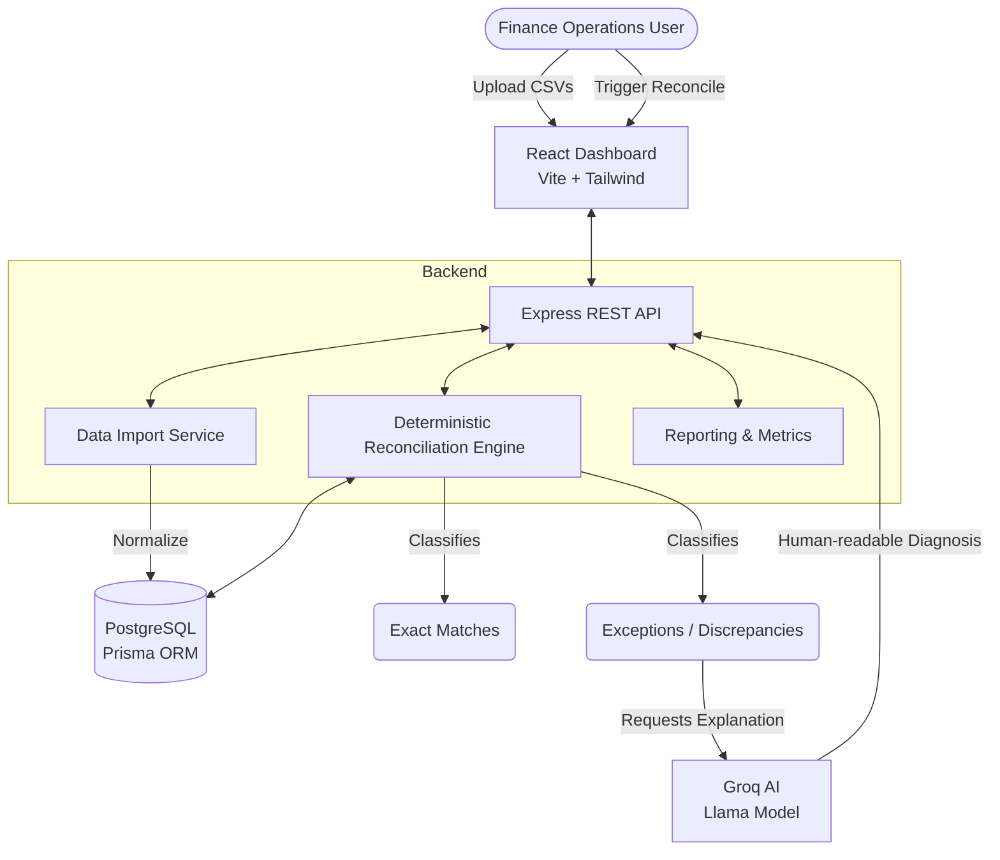

# AI Finance Controller

An AI-assisted multi-source financial reconciliation system designed for the **Razorpay AI Buildathon (Track 04 — AI Finance Controller)**.

## Core Principle
**Automate what can be determined confidently. Explain what cannot. Never pretend an unresolved financial transaction is resolved.**

This project ingests financial records from multiple sources (Internal Ledger, Payment Gateway Settlements, Bank Statements) and deterministically reconciles them. When discrepancies or missing records occur (exceptions), the system utilizes an LLM (Groq) to provide human-readable, plain-English explanations and actionable recommendations without compromising financial truth.

---

## 🏗️ Architecture



## ✨ Features
- **Multi-Source Ingestion**: Process Internal Ledgers, PG Settlements, and Bank Statements.
- **Deterministic Reconciliation**: 100% auditable and rule-based matching engine (Exact, Tolerance, Missing, Duplicates).
- **AI Exception Diagnosis**: Generates plain-text explanations and recommendations for mismatches using LLM, strictly sandboxed from deterministic classifications.
- **Fintech UI/UX**: Razorpay-inspired React Dashboard to visualize match rates, run history, and drill down into exceptions.
- **Repeatable & Scalable**: Support for multiple reconciliation runs without unique constraint crashes on the same dataset.
- **Graceful AI Fallback**: If the LLM provider fails or the API key is missing, the core financial reconciliation continues uninterrupted.

---

## 🚀 Quick Start

### Prerequisites
- Node.js (v18+)
- PostgreSQL (Running locally or hosted)
- A Groq API Key (Optional, for AI explanations)

### 1. Installation
This is a monorepo containing both the frontend and backend.

```bash
# Clone the repository
git clone https://github.com/Sashang-debug/AI-Finance-Controller.git
cd AI-Finance-Controller

# Install dependencies for both frontend and backend
npm run install:all
```

### 2. Environment Configuration
Copy the sample environment file and adjust your variables:

```bash
cp .env.example .env
```
Ensure your `DATABASE_URL` points to a valid PostgreSQL database.

### 3. Database Setup
Push the Prisma schema to your database to construct the tables:

```bash
cd backend
npx prisma db push
```

### 4. Running the Application (Development)
You can run the frontend and backend concurrently in development mode.

**Terminal 1 (Backend):**
```bash
cd backend
npm run dev
```

**Terminal 2 (Frontend):**
```bash
cd frontend
npm run dev
```
Navigate to `http://localhost:5173` in your browser.

---

## 📦 Production Deployment

For production (e.g. Render, Heroku, VPS), the Express server acts as a unified service that statically serves the React frontend.

```bash
# Build the React frontend and compile the TypeScript backend
npm run build

# Start the unified production server
NODE_ENV=production npm start
```
The application will be available at `http://localhost:3000`.

---

## 📊 Using the Dashboard
1. Go to the **Import Data** tab.
2. Upload `ledger.csv`, `settlements.csv`, and `bank_statement.csv` (sample files are provided in `backend/data/`).
3. Return to the **Dashboard** and click **Run Reconciliation**.
4. Click **View details** to inspect exceptions.
5. Click **Investigate** on any exception to trigger the AI analysis.

---

## 🛡️ Security & Integrity Rules
- The UI never computes financial matches; all logic is deterministic in the backend.
- The LLM receives structured JSON schemas containing *only* the anomalous transaction, eliminating hallucinations about historical data.
- The database enforces uniqueness per-run via composite indexes (`@@unique([runId, ledgerRecordId])`), ensuring repeatability.
